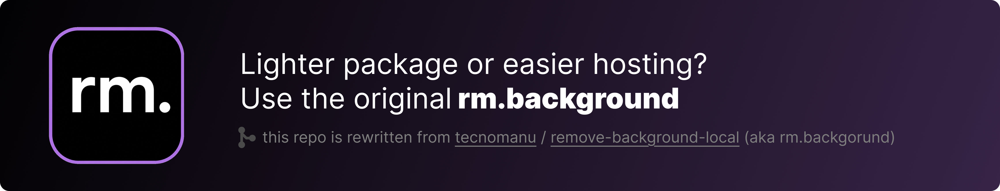

  
  <h1>Remove.Simply</h1>
  
<strong>A private desktop app for clean background removal.</strong>

  
Built with Electron, React, HeroUI, ONNX Runtime, and Transformers.js.

 

  

 

<table width="100%" cellpadding="12" cellspacing="0" border="1">
  <tr>
    <td align="center"><strong>Local processing</strong> Images are processed on your machine.</td>
    <td align="center"><strong>Model control</strong> Download, delete, and choose AI models.</td>
    <td align="center"><strong>Flexible output</strong> Export PNG, WebP, or JPG.</td>
  </tr>
</table>

<h2>Overview</h2>

  Remove.Simply is a self contained Electron app for removing image backgrounds.
  It uses a native desktop shell, a React interface, and local model inference through ONNX Runtime.
  The app does not need a Python server or a browser based HTTP service.

<h2>Features</h2>

<table width="100%" cellpadding="10" cellspacing="0" border="1">
  <tr>
    <th align="left">Area</th>
    <th align="left">What it does</th>
  </tr>
  <tr>
    <td><strong>Main window</strong></td>
    <td>Drag images into the app, paste images from the clipboard, process a queue, preview results, and download finished files.</td>
  </tr>
  <tr>
    <td><strong>Settings window</strong></td>
    <td>Choose output format, quality, background mode, solid color, upload size, execution provider, and alpha matting controls.</td>
  </tr>
  <tr>
    <td><strong>Models window</strong></td>
    <td>Manage local model downloads, view model status, remove cached models, and set the default model.</td>
  </tr>
  <tr>
    <td><strong>Model lineup</strong></td>
    <td>Includes ISNet, BiRefNet, U2Net, human segmentation, portrait, and lite options.</td>
  </tr>
  <tr>
    <td><strong>Privacy</strong></td>
    <td>Images stay local during processing. Model files are cached in the app data folder.</td>
  </tr>
</table>

<h2>Tech Stack</h2>

<table width="100%" cellpadding="10" cellspacing="0" border="1">
  <tr>
    <th align="left">Part</th>
    <th align="left">Technology</th>
  </tr>
  <tr>
    <td>Desktop shell</td>
    <td>Electron</td>
  </tr>
  <tr>
    <td>Interface</td>
    <td>React, HeroUI, Tailwind CSS, Framer Motion</td>
  </tr>
  <tr>
    <td>Build system</td>
    <td>Electron Vite</td>
  </tr>
  <tr>
    <td>Inference</td>
    <td>Transformers.js with ONNX Runtime Node</td>
  </tr>
  <tr>
    <td>Image encoding</td>
    <td>Sharp</td>
  </tr>
  <tr>
    <td>Settings storage</td>
    <td>Electron Store</td>
  </tr>
  <tr>
    <td>Packaging</td>
    <td>Electron Builder</td>
  </tr>
</table>

<h2>Getting Started</h2>

<h3>Requirements</h3>

<table width="100%" cellpadding="10" cellspacing="0" border="1">
  <tr>
    <td>Node.js</td>
    <td>Use a current LTS release.</td>
  </tr>
  <tr>
    <td>pnpm</td>
    <td>The project includes a pnpm lockfile and workspace file.</td>
  </tr>
</table>

<h3>Install</h3>

<pre><code>pnpm install</code></pre>

<h3>Run In Development</h3>

<pre><code>pnpm dev</code></pre>

<h3>Type Check</h3>

<pre><code>pnpm typecheck</code></pre>

<h3>Build</h3>

<pre><code>pnpm build</code></pre>

<h3>Create A Desktop Release</h3>

<pre><code>pnpm dist</code></pre>

  Release files are written to the <code>release</code> folder.

<h2>Project Structure</h2>

<table width="100%" cellpadding="10" cellspacing="0" border="1">
  <tr>
    <th align="left">Path</th>
    <th align="left">Purpose</th>
  </tr>
  <tr>
    <td><code>src/main</code></td>
    <td>Electron app lifecycle, windows, IPC handlers, model cache logic, settings, and image processing.</td>
  </tr>
  <tr>
    <td><code>src/preload</code></td>
    <td>Typed bridge between the isolated renderer and the main process.</td>
  </tr>
  <tr>
    <td><code>src/renderer/main</code></td>
    <td>Main drag and drop interface.</td>
  </tr>
  <tr>
    <td><code>src/renderer/settings</code></td>
    <td>Settings window interface.</td>
  </tr>
  <tr>
    <td><code>src/renderer/models</code></td>
    <td>Model download and cache management interface.</td>
  </tr>
  <tr>
    <td><code>src/renderer/shared</code></td>
    <td>Shared providers, branding, and global styles.</td>
  </tr>
  <tr>
    <td><code>build</code></td>
    <td>Desktop app icons used for packaging.</td>
  </tr>
</table>

<h2>Workflow</h2>

<table width="100%" cellpadding="10" cellspacing="0" border="1">
  <tr>
    <td align="center"><strong>1</strong></td>
    <td>Open the Models window and download a model.</td>
  </tr>
  <tr>
    <td align="center"><strong>2</strong></td>
    <td>Choose output defaults in Settings.</td>
  </tr>
  <tr>
    <td align="center"><strong>3</strong></td>
    <td>Drop or paste an image into the main window.</td>
  </tr>
  <tr>
    <td align="center"><strong>4</strong></td>
    <td>Preview the result and download the finished file.</td>
  </tr>
</table>

<h2>Output Options</h2>

<table width="100%" cellpadding="10" cellspacing="0" border="1">
  <tr>
    <th align="left">Format</th>
    <th align="left">Best for</th>
  </tr>
  <tr>
    <td>PNG</td>
    <td>Transparent results and lossless output.</td>
  </tr>
  <tr>
    <td>WebP</td>
    <td>Small file size with optional transparency.</td>
  </tr>
  <tr>
    <td>JPG</td>
    <td>Solid background exports for broad compatibility.</td>
  </tr>
</table>

<h2>Notes</h2>

<table width="100%" cellpadding="10" cellspacing="0" border="1">
  <tr>
    <td>First use may require downloading a model before image processing is available.</td>
  </tr>
  <tr>
    <td>CoreML is intended for supported Apple Silicon Macs. CPU mode is the portable default.</td>
  </tr>
  <tr>
    <td>JPG cannot preserve transparency, so the configured solid background color is used.</td>
  </tr>
</table>

<h2>License</h2>

  Add a license file before publishing or distributing this project.

